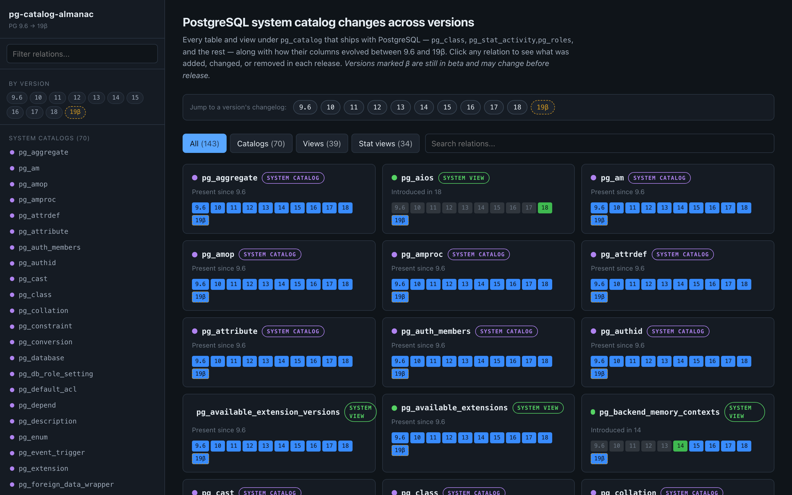
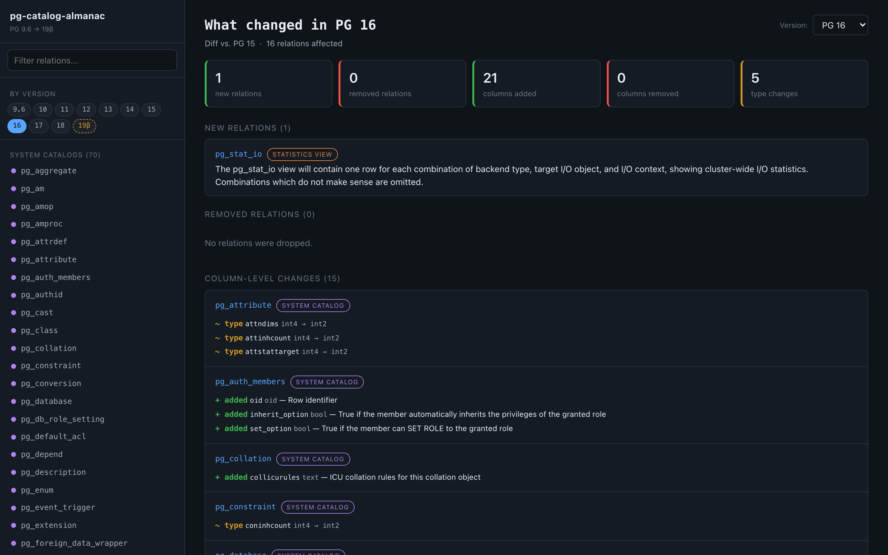
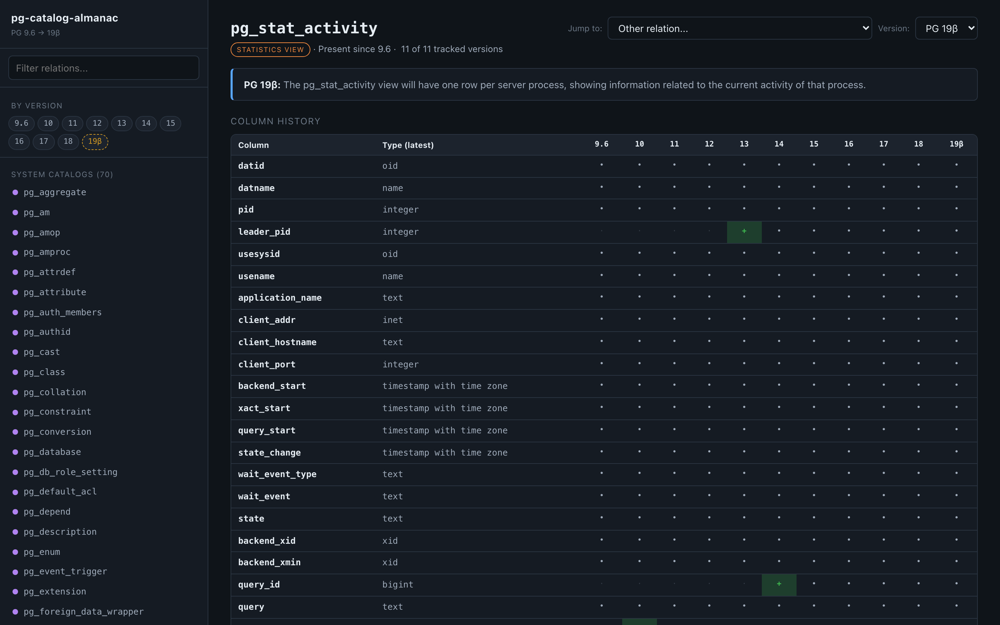

# pg-catalog-almanac

A tiny web app that visualizes how PostgreSQL's `pg_catalog` schema — the
system catalogs (`pg_class`, `pg_am`, `pg_proc`, …), the system views
(`pg_roles`, `pg_locks`, `pg_indexes`, …), and the statistics views
(`pg_stat_activity`, `pg_stat_replication`, `pg_stat_io`, …) — has evolved
across PostgreSQL major versions.

Track when a column was added, when its type changed, and when a whole
relation first appeared. Great for extension authors, DBAs writing
version-portable queries, and anyone who's ever wondered "wait, does
`pg_stat_activity.leader_pid` exist in 12?"

## Screenshots

### Home — every relation, every version at a glance


### "What changed in PG 16" — per-version changelog


### Relation detail — column history matrix


## What's inside

- **Home page** — every relation grouped by kind (catalog / view / stat view),
  with tiny per-version presence chips. A version strip at the top jumps
  straight to any release's changelog.
- **Version changelog** (`#/v/16`) — pick a PG version and see everything that
  changed *because of* that release: new relations, dropped relations, columns
  added/removed, and column type changes, each linking back to the relation
  detail view.
- **Relation detail** — a matrix of columns × versions with add / change /
  remove highlights, plus the full column list at any version you pick from
  the version dropdown. The description blurb comes from the PostgreSQL SGML
  docs at that version.
- **Sidebar navigator** — searchable, always-visible list of every relation
  plus a row of version pills.
- Data is generated once at build time from the PostgreSQL SGML source at each
  release tag (`REL_18_6`, `REL_17_11`, …, `REL9_6_24`) and shipped as a
  single JSON file — no backend required. Unreleased next majors are picked
  up automatically from `REL_XX_BETAn` tags and shown as e.g. `19β`.

## Data source

`scripts/extract-catalog-data.mjs` walks a local checkout of the PostgreSQL
git repository, does `git show TAG:doc/src/sgml/catalogs.sgml` (etc.) for each
release tag, parses out every `<sect1 id="catalog-...">`, `<sect1 id="view-...">`,
and `<sect2 id="monitoring-...">` block (plus legacy `<table id="pg-stat-...">`
tables for pre-13), and emits `src/data/catalog.json`.

## Updating for a new PostgreSQL release

The extractor auto-discovers major versions from git tags, so a new release
usually needs zero code changes.

1. **Pull latest tags in your postgres checkout:**

   ```sh
   cd /path/to/postgres && git fetch --tags
   ```

2. **Regenerate the dataset:**

   ```sh
   cd /path/to/pg-catalog-almanac
   PG_REPO=/path/to/postgres npm run extract
   ```

   By default the script scans every `REL9_x_y` and `REL_XX_y` tag from PG 9.6
   forward, picks the latest minor of each released major, and appends the
   latest `REL_XX_BETAn` tag of any next major that hasn't shipped yet (shown
   as `19β`, `20β`, etc.). The chosen tag for each major is recorded in
   `catalog.json` under `versionTags`.

3. **Rebuild the container:**

   ```sh
   docker compose up -d --build
   ```

4. **Commit the updated JSON:**

   ```sh
   git add src/data/catalog.json && git commit -m "Data refresh: add PG 20"
   ```

### Extraction knobs

- `PG_REPO=/path/to/postgres` — location of the postgres checkout (default `../postgres`).
- `PG_MAJORS=9.6,10,...,20,20b` — override the auto-discovered list.
- `PG_MIN_MAJOR=13` — drop older majors from the auto-discovered list.
- `PG_AUTO=0` — disable auto-discovery entirely (uses the hard-coded default list).

### Adding a not-yet-released major manually

If beta tags aren't cut yet but you want to preview `master`, tag it locally:

```sh
cd /path/to/postgres && git tag REL_20_BETA0 master
cd /path/to/pg-catalog-almanac && npm run extract
```

## Quick start

### Docker (recommended)

```sh
docker compose up --build
# open http://localhost:8080
```

### Local dev

```sh
npm install
npm run extract        # generates src/data/catalog.json (needs ../postgres checkout)
npm run dev            # http://localhost:5173
```

## Hosting on GitHub Pages

The repo ships with a GitHub Actions workflow
([.github/workflows/deploy.yml](.github/workflows/deploy.yml)) that builds and
publishes to Pages on every push to `main`. Live URL will be:

> **https://richyen.github.io/pg-catalog-almanac/**

One-time setup:

1. Push this repo to GitHub (already done).
2. In the repo's **Settings → Pages**, set *Source* to **GitHub Actions**.
3. Trigger the workflow — either push a commit or hit
   *Actions → Deploy to GitHub Pages → Run workflow*. The first run enables
   the environment and publishes the site.

The workflow builds with `VITE_BASE=/pg-catalog-almanac/` so assets resolve
under the subpath. Deep links work without extra rewrites because the app uses
hash routing (`#/r/pg_class`, `#/v/16`, …). Nothing else is needed.

### Linking from `richyen.github.io`

If you'd like a shortcut from your user site, add a card/link on
`richyen.github.io` pointing at `https://richyen.github.io/pg-catalog-almanac/`.
User-site repos and project-site repos are served independently — no
sub-repository setup is required.

## Project layout

```
scripts/extract-catalog-data.mjs   # SGML parser -> src/data/catalog.json
src/data/catalog.json              # pre-generated dataset (committed)
src/lib/catalog.js                 # matrix / lifespan helpers
src/pages/Home.jsx                 # relation index
src/pages/Relation.jsx             # per-relation history view
src/components/Sidebar.jsx         # navigator
Dockerfile / nginx.conf            # production image
```

## License

MIT
